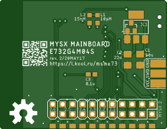

# MySX-boards

## MCU Board
### E73-2G4M04S 
 

### ATMega328-RF24

### BluePill 

 

[Link](boards/BluePill)

## Other
### Wiz5500 

### Wiz5100 

### Serial

CP1251 or FTDI 

## Donation
If this project help you, you can give me a cup of coffee | beer | vodka :)

