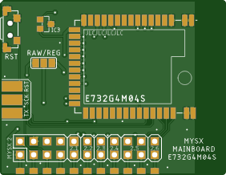
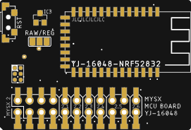
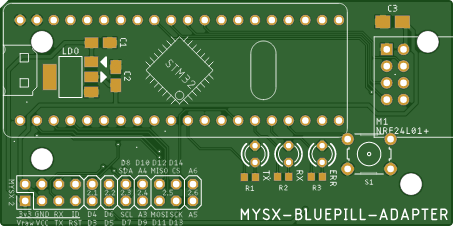
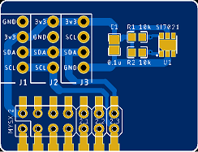
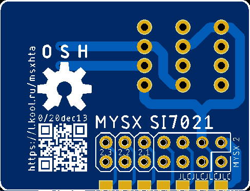
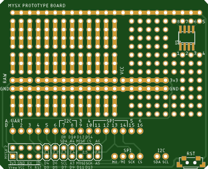

# MySX-boards

[MySensors](https://www.mysensors.org/) is an open source hardware and software community focusing on do-it-yourself home automation and Internet of Things.

IoT devices based on components like, Arduino, ESP8266, Raspberry Pi, NRF24L01+ and RFM69. 

[NodeManager](https://www.mysensors.org/download/node-manager) is intended to take care on your behalf of all those common tasks that a MySensors node has to accomplish, speeding up the development cycle of your projects

[Library for Arduino IDE](https://github.com/KooLru/MySX-boards-library)

## MCU Board
### E73-2G4M04S 
 

[Link](boards/E73-2G4M04S)

### YJ-16048
 

[Link](boards/YJ-16048)

### ATMega328-RF24
Coming soon ...

### BluePill 
 

The Chinese development boards are available from webshops like Ebay, AliExpress, Wish, Taobao, and many more. Can be used for Ethernet or Serial gateway RF 24 network.

[Link](boards/BluePill)

## Sensor boards

### I2C sensor board

Board support many I2C sensors or you can solder HTUxx-like sensor yourself.

 

[Link](boards/HTA)

### AHT10 sensor board

Coming soon ...

## Other

### W5500 

 

[Link](boards/W5500)

### W5100 

Coming soon ...

### Serial

Coming soon ...

CP1251 or FTDI 

### Prototype board

 

[Link](boards/Prototype)

## Donation
If this project help you, you can give me a cup of coffee | beer | vodka :)

