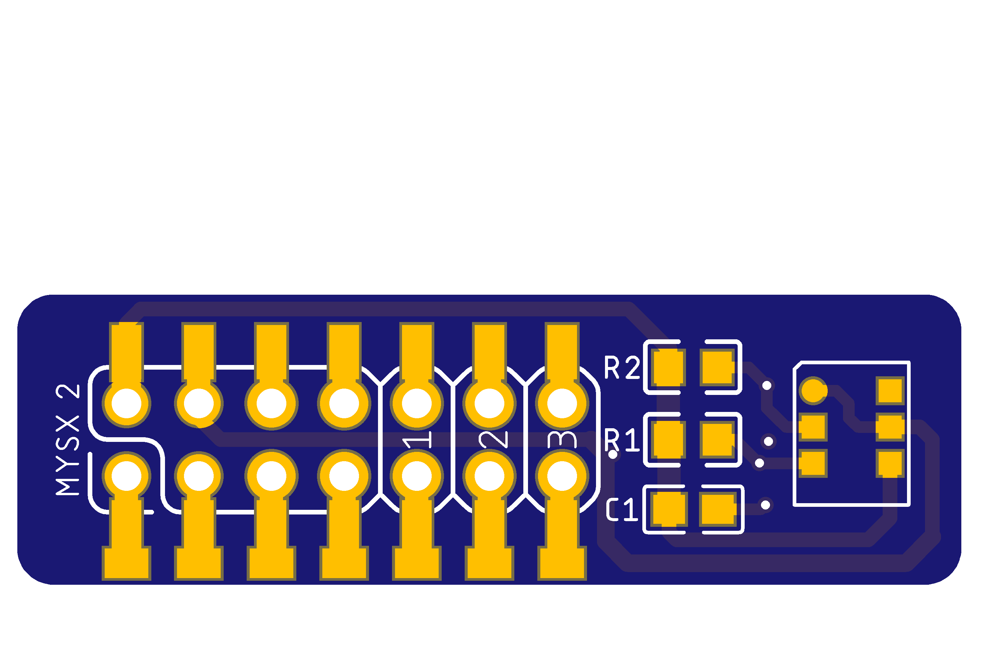

## AHT-10 Sensor Board

AHT10, the new generation of temperature and humidity sensors sets a new standard in size and intelligence: it is embedded for reflow soldering The dual-row flat leadless SMD package has a 4x5mm bottom and a height of 1.6mm. The sensor outputs a calibrated digital signal in standard I2C format. The AHT10 is equipped with a newly designed ASIC- specific chip, an improved MEMS semiconductor capacitive humidity sensing element and a standard on-chip temperature sensing element. Its performance has been greatly improved beyond the reliability level of the previous generation of sensors. The first generation of temperature and humidity sensors have been improved to make them more stable in harsh environments. Each sensor is calibrated and tested with a product lot number printed on the surface of the product. Thanks to improved and miniaturized sensors, it is more cost-effective and ultimately all equipment will benefit from cutting-edge energy-saving operating modes.

## Board

 

## Useul links

https://elchupanibrei.livejournal.com/53764.html

