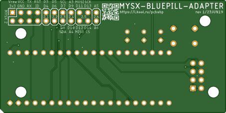

# Blue pill

Some chars about blue pill board
MySensors Gateway with w5500 | w5100 | Serial adapter

## PCB
 

[Actial GERBER files](pcb/bluepill_rev1_2019-06-23.zip) 

## Components

**STM32F103C8T6 "Blue pill" board**  [Aliexpress](https://l.kool.ru/1j7gn)

The Chinese development boards are available from webshops like Ebay, AliExpress, Wish, Taobao, and many more. 

More info: [stm32-base.org](https://stm32-base.org/boards/STM32F103C8T6-Blue-Pill.html) 

**MYSX Pinheader** [2x10 male](http://ali.pub/3063a0 ) 

**NRF24 Pinheader** [2x4 female](https://l.kool.ru/hdrf1r)

**S1 switch** [xxxx](https://l.kool.ru/) 

AMS-1117-3.3 LDO

Passive componetns

C1 capacitor
C2 capacitor
C3 capacitor

R1-R2 

L1-L3

## Useful links
[Set up STM32 "blue pill" for Arduino IDE](https://www.onetransistor.eu/2017/11/stm32-bluepill-arduino-ide.html)

[How to burn STMduino bootloder (RUS)](https://elchupanibrei.livejournal.com/30157.html)

[Pinout source](https://predictabledesigns.com/introduction-stm32-blue-pill-stm32duino/)

## Donation
If this project help you, you can give me a cup of coffee | beer | vodka :)

