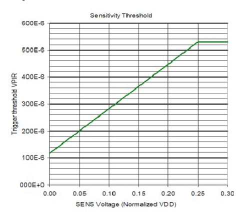

## PIR-612 Sensor Board

AM612 digital PIR sersor

## Board

 

## Components

|Part|Value|Package/metric|Link|
|----|----|:----:|----|
U1  |AM612 PIR Sensor||[AEX](https://l.kool.ru/pir612) 
C1,C2|100n|0603/1608||
R5|10k|0603||
||Duration trimm||
R1|1M5|0603||
R2|500K|3314G||
||Duration fixed|
R1|*|0603
R2.1|*|0603||
||Sensivity trimm||
R3|1M5|0603||
R4|500K|3314G||
||Sensivity fixed|
R3|*|0603
R4.1|*|0603||
||Led activity|
R6|1K|0603||
D1|RED|0805||
||MYSX Expander
X1   |2x7                 |PLD-14|**MYSX 2.3 Pinheader** [2x07 female](http://ali.pub/3063a0 ) 

## Settings

### Fixed on time values
|VDD div|ADC|On time in seconds|On time|Pull-up (R1), Ohm|Pull-down (R2.1), Ohm|
|----|----|:----:|----|----|----|
0,0078125|	0	|2		|00:02		|-			|0
0,0234375|	1	|4		|00:04		|1M	|2K4
0,0390625|	2	|6		|00:06		|1M	|39K
0,0546875|	3	|8		|00:08		|1M	|62k
0,0703125|	4	|16		|00:16		|1M	|75k
0,0859375|	5	|33		|00:33		|1M	|91K
0,1015625|	6	|49		|00:49		|1M	|110K
0,1171875|	7	|66		|01:06		|1M	|130K
0,1328125|	8	|131	|02:11		|1M	|150K
0,1484375|	9	|262	|04:22		|1M	|180K
0,1640625|	10	|393	|06:33		|1M	|200K
0,1796875|	11	|524	|08:44		|1M	|220K
0,1953125|	12	|1049	|17:29		|1M	|240K
0,2109375|	13	|2097	|34:57		|1M	|270K
0,2265625|	14	|3146	|52:26		|1M	|300K
0,2421875|	15	|4194	|01:09:54	|0			|-

### Fixed sensivity values

SENS pins decides how sensitive it is. Default put it to Ground (Maximum) ( R4.1 = 0 Ohm, C2 and R3 not need)
A voltage applied to the SENS input sets the threshold used to detect a PIR Signal. VSS selects the minimum threshold voltage. Any
voltage above VDD/4 will select the maximum threshold, which is the least sensitive setting for PIR signal detection.

## Useul links

