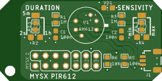
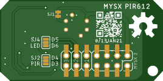

## PIR-612 Sensor Board

AM612 digital PIR sersor

## Board

 

## Components

|Part|Value|Package/metric|Link|
|----|----|:----:|----|
U1  |AM612 PIR Sensor||[AEX](https://l.kool.ru/pir612) 
C1,C2|100n|0603/1608||
R5|10k|0603||
||Duration trimm||
R1|1M5|0603||
R2|500K|3314G||
||Duration fixed|
R1|1M5|0603
R2.1||0603||
||Sensivity trimm||
R3|1M5|0603||
R4|500K|3314G||
||Sensivity fixed|
R3|1M5|0603
R4.1||0603||
||Led activity|
R6|1K|0603||
D1|RED|0805||
||MYSX Expander
X1   |2x7                 |PLD-14|**MYSX 2.3 Pinheader** [2x07 female](http://ali.pub/3063a0 ) 

## Useul links

https://elchupanibrei.livejournal.com/53764.html

