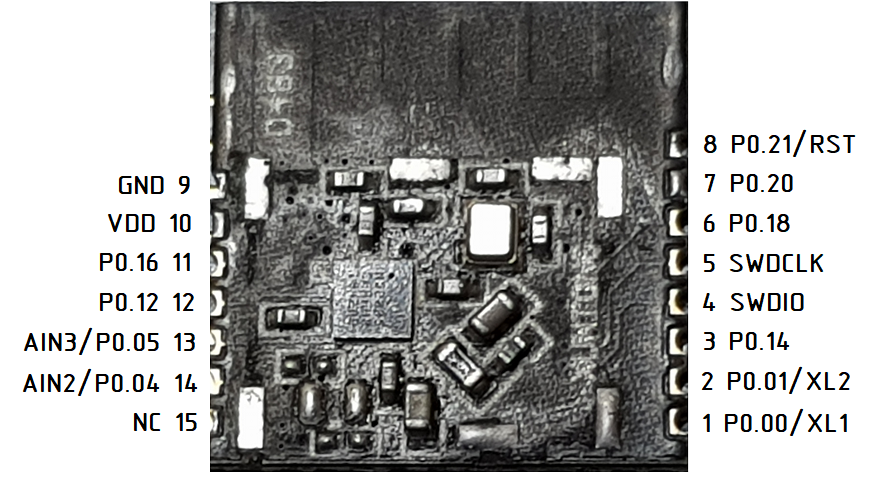
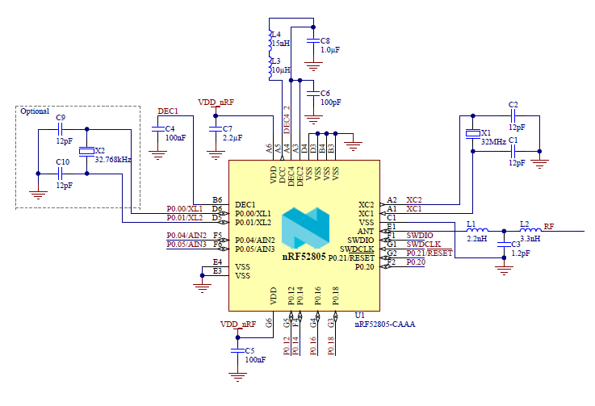
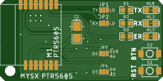
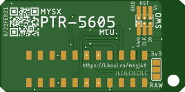

# MYSX MCU PTR-5605

Module pinout 

Module schema

Mainboard with MYSX connector for MySensors 

## PCB
 

## Components

**PTR-5605** module [Aliexpress](https://l.kool.ru/lenyo) 

**MYSX Pinheader** 
[2x10 male](http://ali.pub/3063a0)  or [2x10 female](http://ali.pub/3063a0) or [2x10 SMT female](http://ali.pub/3063a0) or solder it together

**Reset switch**
[3x6x3.5](https://l.kool.ru/obw9w) reset 
