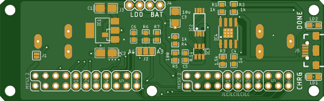
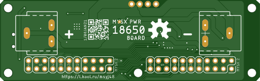

## Power board 18650

MySX Power Board 18650 for powering MySensors nodes with charger (TP4056), discharge protection (DW01) and 3.3 LDO regulator MCP1703

## PCB

## GERBER files 
[Rev 0](https://raw.githubusercontent.com/KooLru/MySX-boards/master/boards/PWR-18650/release/18650_r1_2021-01-08.zip)

## Components

|Part|Value|Package/metric|Link|
|----|----|:----:|----|
BT2  |Battery holder||[AEX 10 pcs](https://l.kool.ru/0i33r) 
||Charger|
C3   |10u                 |1206/3216||
C4   |1u                  |0603/1608||
C5   |0.1u                |0603/1608||
IC2  |FS8205A             |TSSOP8|[AEX](https://l.kool.ru/r8zi0) [AEX search](https://aliexpress.ru/store/1089340/search?origin=y&SearchText=FS8205A+)
IC3  |DW01-P              |SOT23-6L|[AEX](https://l.kool.ru/r8zi0) [AEX search](https://aliexpress.ru/store/1089340/search?origin=y&SearchText=FS8205A+)
IC4  |TP4056              |SOIC-8|[AEX](https://l.kool.ru/irm78) 
LD1  |red                 |0805|              
LD2  |green               |0805|              
R1,R2,R4|1k               |0603||
R3   |1.5k                |0603||
R5   |100                 |0603||
J5   |USB-B-MICRO-SMD     ||[AEX 10 pcs](https://l.kool.ru/rl9vq) 
||LDO MCP1703||
C1,C2|1u                  |1206/3216|
IC1  |MCP1703T-3302E/CB   |SOT-23|[TE](https://www.terraelectronica.ru/product/358293) 
||LDO TLV1117||
C1   |10u                 |1206/3216|
C2   |22u                 |1206/3216|
IC1  |REG1117             |SOT-223|[TE](https://www.terraelectronica.ru/product/268036) 
||Measurement|
C6   |0.1u                |0603/1608|+
R6   |330k                |0603||
R7   |1M                  |0603||
||MYSX Expander
X1,X2   |2x10                |PLD-20|**MYSX 2.5 Pinheader** [2x10 male](http://ali.pub/3063a0 ) 

## Usage

### Charge current.

The charge current can be set by the R3 resistor
|R3 (k)|IBAT (mA)|
|----|----|
|10|130|
|5|250|
|4|300|
|3|400|
|2|580|
|1.66|690|
|1.5|780
|1.33|900|
|1.2|1000|

By default soldered 1.6 KOhm for 800 mA charge current.

### Battery voltage measurement

Battery voltage can be measured via A3 ot A4 analog pin, setted by J2 solder jumper.

## Stores

[tindie](https://www.tindie.com/products/koolru/mysx-power-board-18650/) 

[EBay](https://www.tindie.com/products/koolru/mysx-power-board-18650/) 
