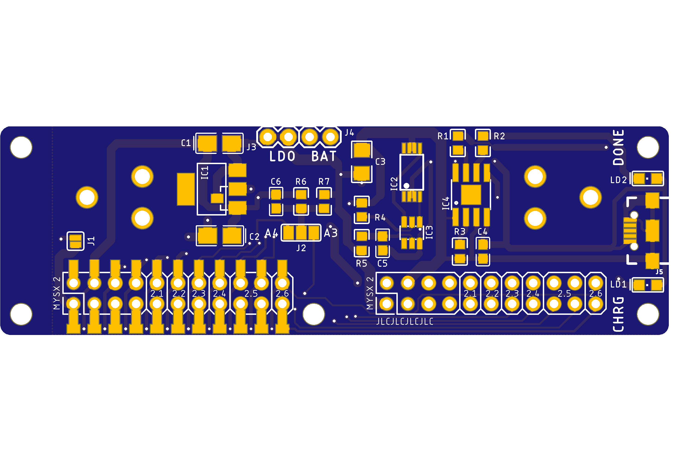

## Power board 18650

Board with charger and 3.3v LDO 

## PCB

GERBER files (coming soon)

## Components

|Part|Value|Package|Link|
|----|----|:----:|----|
BT2  |Battery holder||

|Charger|
C3   |10u                 |1206/3216||terra
C4   |1u                  |0603/1608||terra
C5   |0.1u                |0603/1608||+
IC2  |FS8205A             |TSSOP8|[AEX](https://l.kool.ru/r8zi0) [AEX search](https://aliexpress.ru/store/1089340/search?origin=y&SearchText=FS8205A+)
IC3  |DW01-P              |SOT23-6L|[AEX](https://l.kool.ru/r8zi0) [AEX search](https://aliexpress.ru/store/1089340/search?origin=y&SearchText=FS8205A+)
IC4  |TP4056              |SOIC-8|[AEX](https://l.kool.ru/irm78) 
LD1  |red                 |0805|              
LD2  |green               |0805|              
R1   |1k                  |0603||terra
R2   |1k                  |0603||terra
R3   |1.5k                |0603||
R4   |1k                  |0603||terra
R5   |100                 |0603||terra
J5   |                    |USB-B-MICRO-SMD|           

|LDO MCP1703||
C1   |1u                  |1206/3216|
C2   |1u                  |1206/3216|
IC1  |MCP1703T-3302E/CB   |SOT-23|[TE](https://www.terraelectronica.ru/product/358293) 

|LDO TLV1117||
C1   |10u                 |1206/3216|
C2   |22u                 |1206/3216|
IC1  |REG1117             |SOT-223|
IC1.1|MCP1703CB           |SOT-23|

|Measurement|
C6   |0.1u                |0603/1608|+
R6   |330k                |0603||      terra               
R7   |1M                  |0603||terra

|MYSX Expander
X1   |2x10                |PLD-20|**MYSX 2.5 Pinheader** [2x10 male](http://ali.pub/3063a0 ) 
X2   |2x10                |PLD-20|**MYSX 2.5 Pinheader** [2x10 male](http://ali.pub/3063a0 ) 

## variation 

IC1 LDO MCP1703 C1 C2 ceramic 1uf

DIO5158 