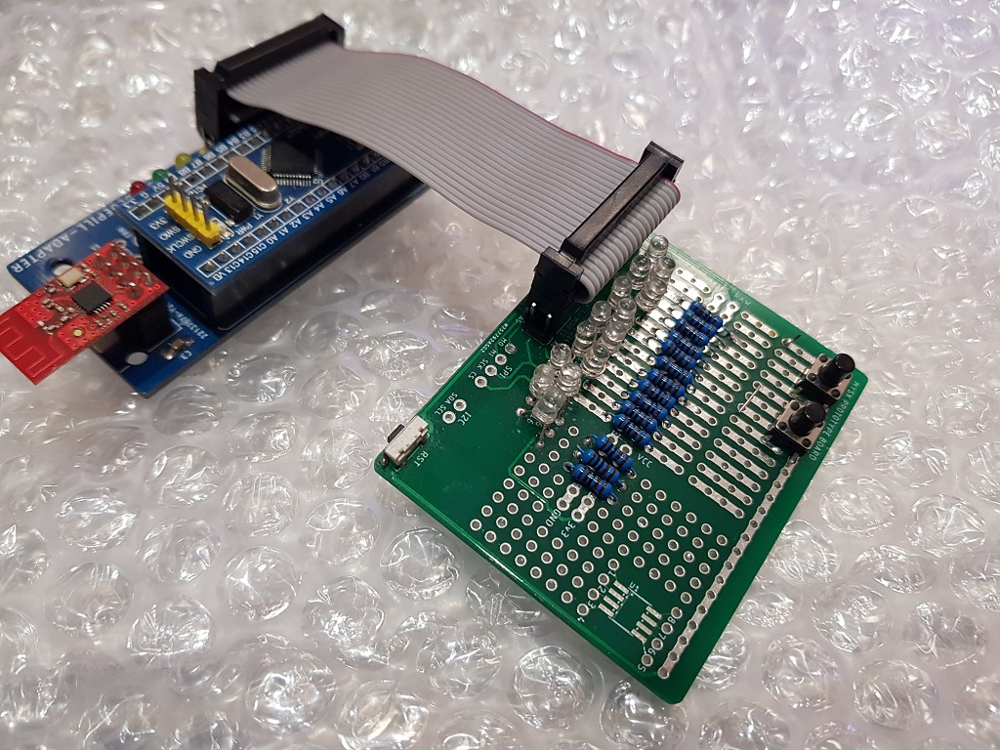

# Prototype

Help develop new boards

## PCB
 

[Actial GERBER files](pcb/proto_2020-05-04.zip) 

## Samples

Board for checking the correct operation of the MYSX boards
 

## Components

**MYSX Pinheader** [PLD20 2x10 male](https://l.kool.ru/pld ) or [PLS20 2x10 male](https://l.kool.ru/pls ) 

**S1 Micro Tact Switch** [SMD switch 3*6*3.5](https://l.kool.ru/sw363) 

