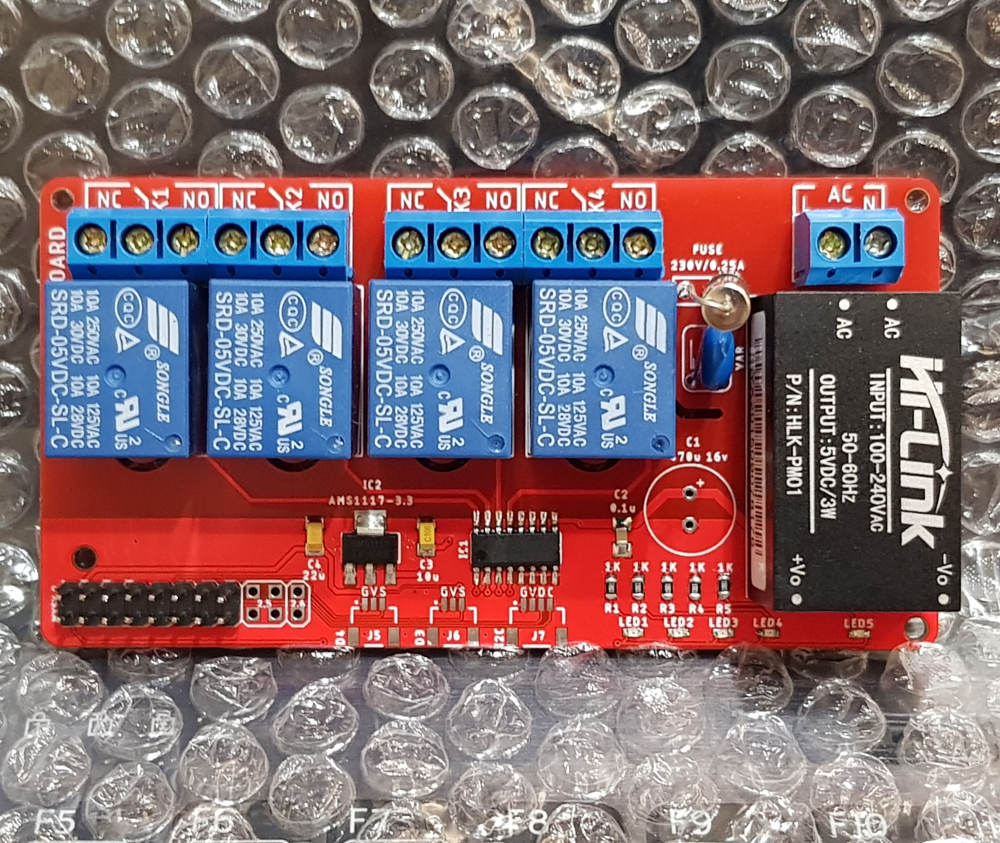
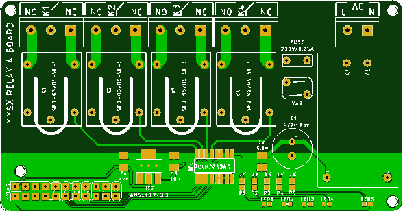
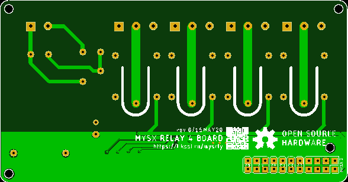

# MYSX Relay Board
Board with relays and MYSX connector

 

## Introduction

Switch up to 4 channels

## PCB
 

## Component list
- PSU **HI-Link HLK-PM01** | [AliExpress](https://l.kool.ru/) | [Datasheet](http://www.hlktech.net/product_detail.php?ProId=54)
- Relay **SRD-05VDC-SL-C** x4 | [AliExpress 50 pcs](https://l.kool.ru/nigsj) | [Datasheet](datasheets/SRD-05VDC-SL-C.pdf)
- ULN2003 | [AliExpress 10-20 pcs](https://l.kool.ru/uln10) | [AliExpress 50 pcs](https://l.kool.ru/hsdub) 
- 3P 5mm Termianl KF301-5.0 3P x4 [AliExpress 10 pcs](https://l.kool.ru/w23yq)
- 2P 5mm Termianl KF301-5.0 2P x1 [AliExpress 10 pcs](https://l.kool.ru/w23yq)
- Varistor  VDR-07D471 (S07K300) [aliexpress](https://l.kool.ru/var7d) | [chipdip](https://www.chipdip.ru/product/fnr-07d471-s07k300-470)
- Fuse 10mm 0.25A [aliexpress](https://l.kool.ru/fuse1s)
- Caps 

C1 470-1000 uF 10v

C2 0.1uF 1206
- Resistors 

R1-R4 1K 0603

R5    1K 0603

- LED 0603 [aliexpress](https://l.kool.ru/led0603)

LED1-LED4 yellow or red (or your favorite color) indicate relay state

LED5 green (or your favorite color) indicate power on

- 1x10 pinheader | PBD-20 | DS1023-2x10 [aliexpress](https://l.kool.ru/hdrf1r)

## Making guide

0. Make or [order PCB](https://jlcpcb.com/) 

1. Solder it together

2. Connect MCU board with relay firmware

3. Enjoy !
