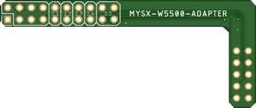
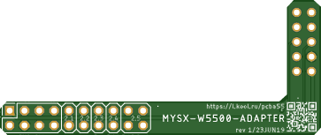

# W5500 Adapter

Connect W5500 DIY board to any board with MYSX connector

The [W5500 chip](https://www.wiznet.io/product-item/w5500/) is a Hardwired TCP/IP embedded Ethernet controller that enables easier internet connection for embedded systems using SPI (Serial Peripheral Interface).

## PCB
 

## Components

**W5500 module** [aliexpress](http://ali.pub/2z6fva)

**MYSX Pinheader** [2x10 female](https://l.kool.ru/hdrf2r) 

**NRF24 Pinheader** [2x4 female](https://l.kool.ru/hdrf2r) 

## Components variants

[2x10 male](https://l.kool.ru/hdrm2r) 

[2x4 male](https://l.kool.ru/hdrm2r) 

## Useful links
[Chip description](https://www.wiznet.io/product-item/w5500/)

STM32 Ethernet-RS485 MySensors Gate [openhardware.io](https://www.openhardware.io/view/776/STM32-Ethernet-RS485-MySensors-Gate) [Github](https://github.com/mysensors-rus/STM32_Ethernet-RS485_gate)

[Another board With W5500](https://www.onetransistor.eu/2017/11/stm32-bluepill-arduino-ide.html)
