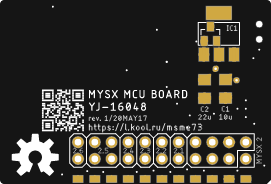

# MYSX MCU YJ-16048

Mainboard with MYSX connector for MySensors 

## PCB
 

## Components

**YJ-16048** module | [HolyIoT aliexpress store](http://ali.pub/2z6fva) | [Aliexpress](https://l.kool.ru/lenyo) 

**MYSX Pinheader** 
[2x10 male](http://ali.pub/3063a0)  or [2x10 female](http://ali.pub/3063a0) or [2x10 SMT female](http://ali.pub/3063a0) or solder it together

**Reset switch**
[3x6x3.5](https://l.kool.ru/obw9w) reset 

LDO AMS-1117 & capacitors (optional)

